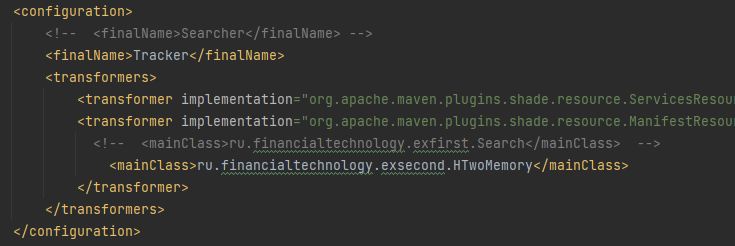

Задача 1
Имеется корневая папка. В этой папке могут находиться текстовые файлы, а также другие папки. В других папках также могут находится текстовые файлы и папки (уровень вложенности может оказаться любым).
Найти все текстовые файлы, отсортировать их по имени и склеить содержимое в один текстовый файл.

Задача 2
Имеется embedded реляционная база данных (h2, hsqldb, sqlite и т.д. - любая sql embedded БД). Завести в БД таблицу данных о студентах, которая будет содержать: имя, фамилия, отчество, дата рождения, группа, уникальный номер.
Реализовать консольный или графический пользовательский интерфейс, с помощью которого можно: добавить студента, удалить студента по уникальному номеру, вывести список студентов.

Требования к выполненным заданиям:
- Версия java любая из трех: 8, 11, 17
- Код проекта присылать в любом виде: zip архив, ссылка на github, bitbucket и т.д.
- Приложение не должно требовать для работы предварительного ручного выполнения sql скриптов, таблицы должны автоматически создаваться при запуске приложения.
- После сборки проекта приложение должно быть готово для запуска одной командой

Для запуска задачи 1:
Соберите проект. 

Для сборки удалите тэги <finalName> и <mainClass>.
Раскомментируйте аналогичные. Соберите проект.

Для запуска введите команду 
java -jar Searcher.jar сканируемая директория
в командной строке. Например: java -jar Searcher.jar c:/windows
В папке с программой появится файл out.txt.

Для запуска задачи 2:
Оставьте всё, как есть. Соберите проект. Для запуска введите команду
java -jar Tracker.jar
в командной строке. Следуйте инструкциям.